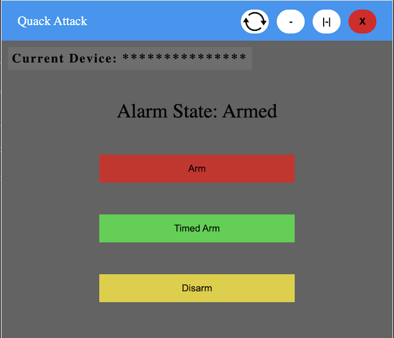
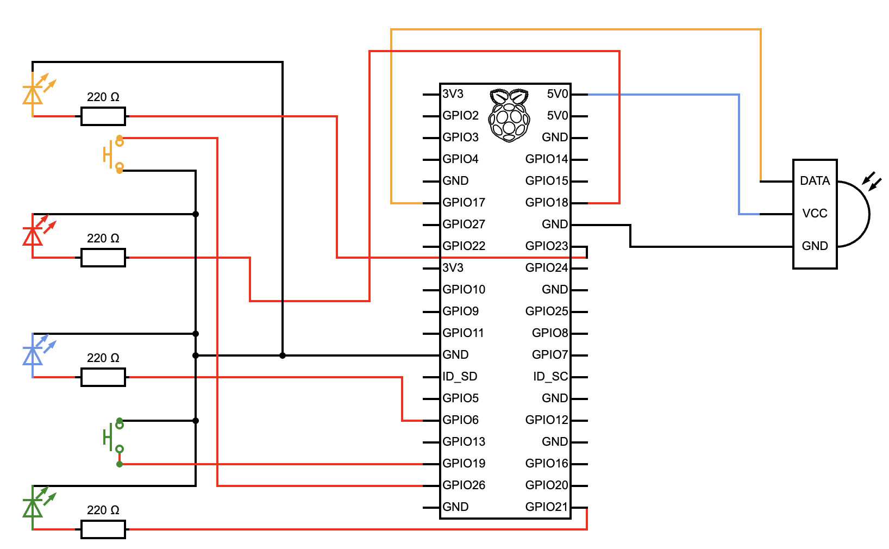

# Quack Attack
*An alarm system that when motion is detected it messages you on slack and can be controlled remotely through [QuackyOS](https://quackyos.com)*

-----

## Table of Contents
- [Features](#features)
- [Compatibility](#compatibility)
- [Circuit](#circuit)
- [Setup](#setup)
- [Run](#run)
- [Usage](#usage)
- [Contributing](#contributing)
- [License](https://github.com/donnie58744/Quack-Attack-Pi/blob/main/LICENSE)

### Features

- #### [QuackyOS Remote Control](#QuackyOS-Remote-Control-1)

  
  
- #### [Slack Messaging Alerts](#slack-messaging-alerts-1)

### Compatibility

- Raspberry PI

### Circuit



### Setup

- #### Electronics
  - Raspberry PI
  - PIR Sensor Model #: HC-SR501
  - 4 LEDs
  - 2 Buttons

- #### Py Library Requirements:

  ```
  pip install RPi.GPIO
  ```

  ```
  pip install mfrc522
  ```

- #### Raspberry PI

  **(GPIO pins are in board mode)**

  - Green Light Pin: 40
  - Blue Light Pin: 31
  - Yellow Light Pin: 16
  - Red Light Pin: 12
  - Green Button Pin: 35
  - Yellow Button Pin: 37
  - Sensor Data Pin: 11 **You might need to adjust the IR Sensor Sensitivity and Time Delay**

- #### Slack Messaging Alerts

  - Create Slack Webhook, [Heres How](https://api.slack.com/messaging/webhooks)

  - Edit the python file and change the webhookUrl varible to your slack webhook

  - Now you can recive alerts from the Alarm on Slack!

- #### QuackyOS Remote Control

  - Create an account if you dont already have one at [QuackyOS](https://QuackyOS.com)
  - Change main.py username and password varibles to your login info
  - When the main.py script is ran it will create a random serial number, you will then see the number on the [Quack Attack](https://quackyos.com?openWindow=QuackAttack) dashboard
  - Now you can control your alarm remotely!

### Run

```python3 main.py```

### Usage

- #### Buttons
  - Green Button
    - Starts a timer so you have time to leave the area

   - Yellow Button
     - Toggles the alarm on and off

- #### Lights

  - Green Light
    - Timer has started and will cycle through all the lights(except red) twice
  - Yellow Light
    - Alarm is On/Off
  - Blue Ligh
    - Used for light cycle
  - Red Light
    - Motion has been detected

### Contributing

- Donovan Whysong ([Afghan Coder](https://github.com/donnie58744)) - Head Of Programming
- Erik Whysong - Head Of Engineering

### License

- View [Here](https://github.com/donnie58744/Quack-Attack-Pi/blob/main/LICENSE)
